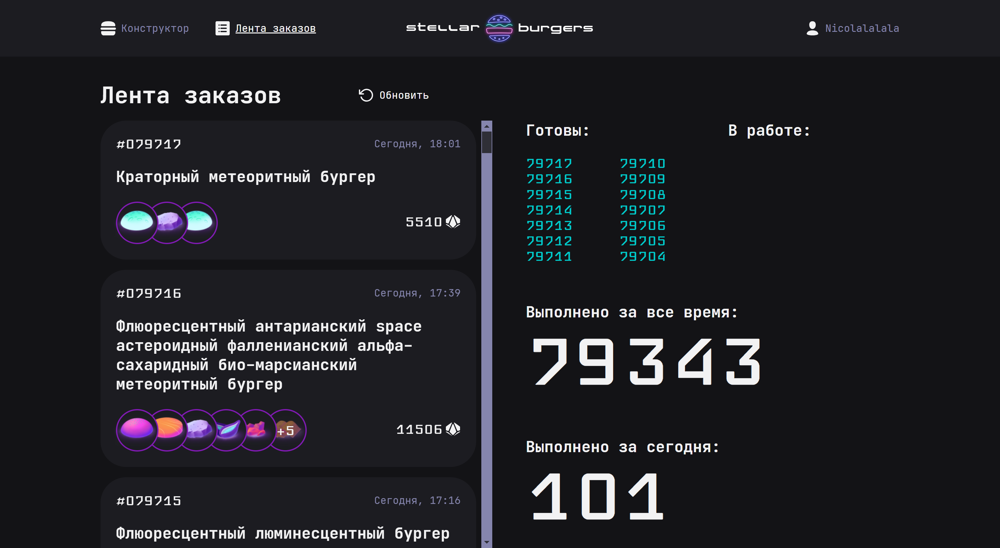
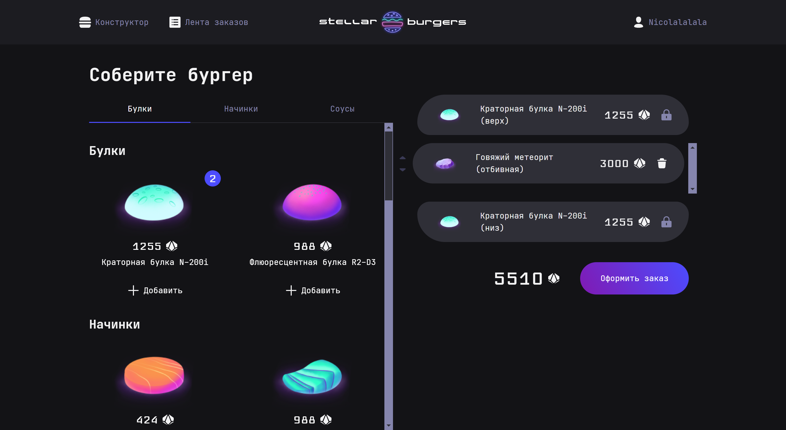

# Проектная работа "Stellar Burger"

Сервис по заказу космических бургеров.npm

## Запуск

Для установки и запуска проекта необходимо выполнить команды

```
npm install
npm run start
```

## Скриншоты





## Автор

- Github - [Catokiy](https://github.com/Catokiy)

## Благодарность

Благодарю команду Яндекс Практикум за предоставление дизайна и уроков!
